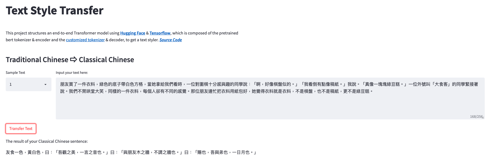

# **Text Style Transfer**

## **Description**
The target of this project is to build a model with the ability to transfer one text style (ex: Traditional Chinese) to other text styles (ex: Classical Chinese). Therefore, this project structures an end-to-end Transformer model using [**Hugging Face**](https://huggingface.co/) & [**Tensorflow**](https://www.tensorflow.org/?hl=zh-tw), which is composed of the pretrained bert tokenizer & encoder and the [customized tokenizer](https://github.com/bobscchien/text-tokenizer) & decoder, to get the text styler.  
For demonstration purpose, [**streamlit**](https://streamlit.io/) is used to deploy this service on the [demo website](https://share.streamlit.io/bobscchien/text-styler/src/streamlit_app.py).

 

## **Dataset**

* [**CCTC**](https://github.com/Scagin/CCTC/): Classical Chinese Translation Corpus   
  >  _Translated Data of Classical Chinese:_
  >> _ShiJi (29 articles)_  
  >> _LunYu (20 articles)_  
  >> _ZhongYong (33 chapters)_  

* [**CCPM**](https://github.com/THUNLP-AIPoet/CCPM): Chinese Classical Poetry Matching Dataset  
  > _CCPM is a large Chinese classical poetry matching dataset that can be used for poetry matching, understanding and translation._  
  > _The main task of this dataset is: given a description in modern Chinese, the model is supposed to select one line of Chinese classical poetry from four candidates that semantically match the given description most. To construct this dataset, we first obtain a set of parallel data of Chinese classical poetry and modern Chinese translation. Then we retrieve similar lines of poetry with the lines in a poetry corpus as negative choices._

 

## **Usage**
**Configuration**  
1. `config/conf.ini` is the configuration file for main program to store `data` & `models` in a seperate data directory, while `config/conf-repo.ini` uses the paths in this repository. 
2. `config/model.cfg` stores the hyperparamters of model structure & training strategy, and ones can tune their models by changing the values in this configuration file. 
3. As for `config/streamlit.cfg` & `config/streamlit-deploy.cfg`, the former one is for local deployment and the latter one is for sharing. Notice that the latter one should correspond to the paths of streamlit deployment in the GitHub repository  

**Main Program - Model Training**  
The usage part and the main program of this project can be divided into 5 parts:
1. Modify the configuration file in `config` based on your setting & environemnt.
2. Run `cd src && python make_dataset.py` to automatically process & save the raw dataset (default: [**CCTC**](https://github.com/Scagin/CCTC/) & [**CCPM**](https://github.com/THUNLP-AIPoet/CCPM)) to intermediate status. This script includes transferring Simplified Chinese to Traditional Chinese, converting halfwidth letters to fullwidth for Chinese (in reverse for English), and other preprocessing processes. 
3. Run `cd src && python make_tokenizer.py` to customize your own tokenizer based on the datasets, which also includes two datasets from [TensorFlow Datasets](https://www.tensorflow.org/datasets/overview) to add more words in the lexicon.
4. Run `cd src && python make_tfrecord.py` to tokenize and transform the CSV dataset (intermediate files) into TFRecord dataset (processed files). For source data, this script uses pretrained tokenizers from [**Hugging Face**](https://huggingface.co/), and results in 2 ~ 3 inputs (tokens, masks, ids) depending on the problem situation. For target data, only 1 output will be generated since here we use the basic form of the Transformer Decoder which refers to [this tutorial](https://www.tensorflow.org/text/tutorials/transformer).
5. Finally, run `cd src && python model_training.py` to train the model with the processed dataset of TFRecord files. The configuration of models and traingings can be modified in `config/model.cfg`, and the outputs of tensorboard logs, model checkpoints, and saved models will be stored based on `config/conf.ini` or `config/conf-repo.ini`.

**Main Program - Streamlit Demonstration**  
1. `src/streamlit_app.py` on GitHub was deployed as a web application via [**Streamlit Share**](https://share.streamlit.io/), and the demonstration of this project can be found [here](https://share.streamlit.io/bobscchien/text-summarizer/src/streamlit_app.py).
2. `requirements.txt` is necessary for deployment, which **Streamlit Share** will first build your environment based on the dependency. More details about application deployment can be found on the [official website](https://docs.streamlit.io/streamlit-cloud/get-started/deploy-an-app).
3. To deploy a large trained model in your application, please refer to [this discussion](https://discuss.streamlit.io/t/how-to-download-large-model-files-to-the-sharing-app/7160/5). However, this method does not work for my project, and thus I use `pip install gdown` and use the api `gdown.download`, which is in `src/clouds/connect_gdrive.py`.

 

## **Further**
* For now, the structure of this project is an naive end-to-end / seq2seq transformer model. To further extend styles that this project can transfer texts into, the methods below will be tested and applied in the future:
  * Use Cycle GAN to train an unsupervised model for any text style without having pair data.

 

## **Reference**

### **Augmentation of Text Data**

https://marssu.coderbridge.io/2020/10/26/nlp-data-augmenatation-%E5%B8%B8%E8%A6%8B%E6%96%B9%E6%B3%95/

### **Cycle GAN of Text Data**
